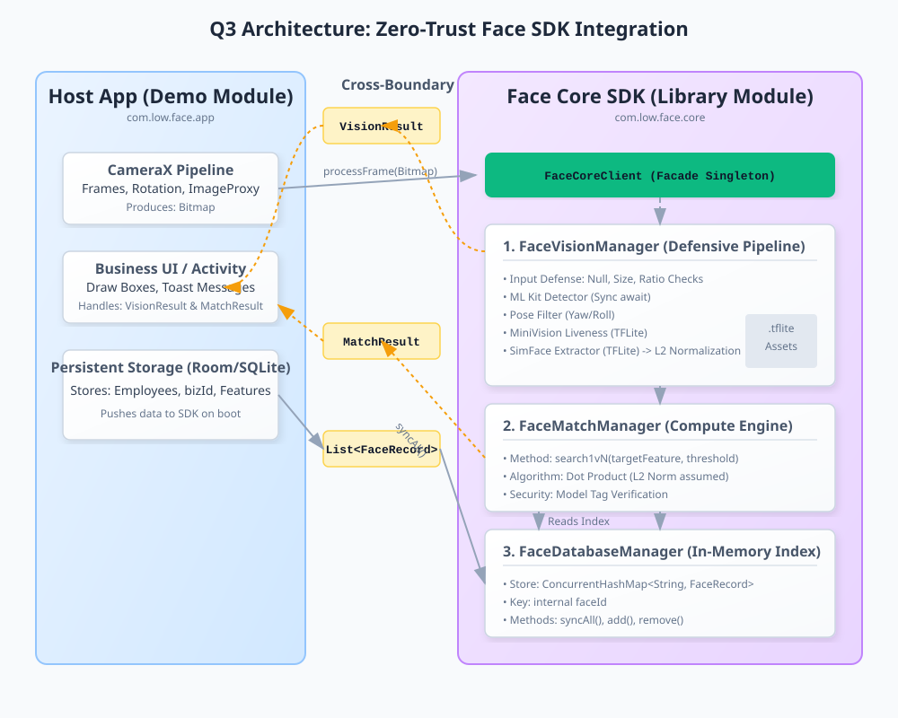

```python
# Generating the exact required prompt text without any fluff or markdown conversational text.
prompt_text = """
# 任务目标：Q3 架构重构 - 拆分纯净的人脸识别 SDK (face-core)

## 0. 架构



## 1. 工程脚手架重构
1. **新建 Module**：在当前 Android 工程中新建一个 Android Library Module，命名为 `face-core`。
2. **依赖迁移**：将原来宿主 `app` 中关于 CameraX 之外的 AI 和图像处理依赖（TFLite、OpenCV）迁移到 `face-core` 的 `build.gradle` 中。
3. **资产迁移**：将所有的 `.tflite` 模型文件从 `app/src/main/assets` 移动到 `face-core/src/main/assets`。

## 2. 领域实体定义 (POJO) - 实施“零信任”原则
请在 `face-core` 中创建 `com.low.face.core.model` 包，并严格按照以下结构创建实体，**严禁引入任何业务字段（如姓名、部门）**：

**2.1 FaceRecord (内部特征最小单元)**
```java
public class FaceRecord {
    public final String faceId;       // 内部物理主键
    public final String bizId;        // 外部业务透传主键 (零信任)
    public final String modelTag;     // 算法模型指纹 (如 "SimFace_V1")
    public final float[] feature;     // L2 归一化后的 512 维特征
    public final String extraTag;     // 盲透传数据包
    public final long createTime;

    public FaceRecord(String faceId, String bizId, String modelTag, float[] feature, String extraTag, long createTime) {
        // 【防御性校验】
        if (feature == null || feature.length != 512) {
            throw new IllegalArgumentException("Feature array must be exactly 512 dimensions.");
        }
        this.faceId = faceId;
        this.bizId = bizId;
        this.modelTag = modelTag;
        this.feature = feature;
        this.extraTag = extraTag;
        this.createTime = createTime;
    }
}

```

**2.2 MatchResult (双轨制比对结果)**

```java
public class MatchResult {
    // 业务轨道 (即看即用)
    public final boolean isMatched;
    public final String matchedBizId;
    
    // 诊断轨道 (深度排查)
    public final String matchedFaceId;
    public final float rawScore;
    public final float appliedThreshold;
    public final int statusCode; // 0-成功, 101-模型指纹不匹配, 201-分数未达标
    public final String diagnosticMessage;
    public final long computeCostMs;

    public MatchResult(boolean isMatched, String matchedBizId, String matchedFaceId, float rawScore, float appliedThreshold, int statusCode, String diagnosticMessage, long computeCostMs) {
        this.isMatched = isMatched;
        this.matchedBizId = matchedBizId;
        this.matchedFaceId = matchedFaceId;
        this.rawScore = rawScore;
        this.appliedThreshold = appliedThreshold;
        this.statusCode = statusCode;
        this.diagnosticMessage = diagnosticMessage;
        this.computeCostMs = computeCostMs;
    }
}

```

**2.3 VisionResult (视觉管线输出)**

```java
import android.graphics.Rect;

public class VisionResult {
    public final int statusCode; // 0-成功, 1-图像非法, 2-未检测到人脸, 3-姿态异常, 4-活体拒绝
    public final String message;
    public final Rect faceBox;   // 用于外部画框
    public final float[] feature; // 请求了特征提取且成功，则返回此特征 (需在此前做L2归一化)

    public VisionResult(int statusCode, String message, Rect faceBox, float[] feature) {
        this.statusCode = statusCode;
        this.message = message;
        this.faceBox = faceBox;
        this.feature = feature;
    }
}

```

## 3. 核心计算接口实现

请在 `face-core` 中创建 `com.low.face.core.engine` 包，实现三大核心引擎组件：

**3.1 FaceVisionManager (防御型视觉管线)**

* 实现 `VisionResult processFrame(android.graphics.Bitmap frame, boolean checkLiveness, boolean extractFeature)` 方法。
* **前置防御要求**：方法最开头必须校验 Bitmap：`null` 检查、`isRecycled()` 检查、最小分辨率限制 (宽>=240, 高>=320) 以及长宽比限制 (最大不可超 1:3)。校验失败直接返回特定 `statusCode` (如 1)。
* **管线流转**：防御通过后，串行调用 ML Kit 检测 -> 姿态角判断 -> MiniVision 活体判别 (若请求) -> SimFace 提取特征 (若请求)。
* **重要**：如果 `extractFeature` 为 `true`，在返回前必须对提取的特征浮点数组执行 **L2 归一化**。

**3.2 FaceDatabaseManager (内存特征索引)**

* 实现一个基于 `java.util.concurrent.ConcurrentHashMap<String, FaceRecord>` 的内存索引库。
* Key 必须是 `FaceRecord` 的 `faceId` (物理主键)。
* 提供基础维护方法：`syncAll(List<FaceRecord>)`, `addOrUpdate(FaceRecord)`, `removeByFaceId(String)`, `clear()`。禁止依赖任何持久化库(如Room/SQLite)。

**3.3 FaceMatchManager (低端机算力匹配引擎)**

* 实现 `MatchResult search1vN(float[] targetFeature, String targetModelTag, float threshold)`。
* **安全防御**：比提示前校验 `targetFeature` 的长度，并在遍历时校验 `targetModelTag` 是否与库中当前记录的 `modelTag` 一致（不一致跳过或报错）。
* **算力榨取**：在内存库中进行 1:N 遍历搜索时，**严禁使用平方根余弦公式**，必须直接计算两个归一化向量的**点积 (Dot Product)**，即将两个浮点数组的各个维度直接相乘并求和，其结果直接作为 `rawScore` 相比于 `threshold` 进行判别。

## 4. 暴露 Facade 门面

创建一个纯粹的单例入口类 `FaceCoreClient`，持有上述三个 Manager 的实例，并暴露出高阶业务方法。宿主 `app` 模块此后只能与 `FaceCoreClient` 交互，彻底屏蔽内部底层 TFLite 和 OpenCV 的复杂性。
"""
print(prompt_text)

```

```text?code_stdout&code_event_index=1

# 任务目标：Q3 架构重构 - 拆分纯净的人脸识别 SDK (face-core)

## 1. 工程脚手架重构
1. **新建 Module**：在当前 Android 工程中新建一个 Android Library Module，命名为 `face-core`。
2. **依赖迁移**：将原来宿主 `app` 中关于 CameraX 之外的 AI 和图像处理依赖（TFLite、OpenCV）迁移到 `face-core` 的 `build.gradle` 中。
3. **资产迁移**：将所有的 `.tflite` 模型文件从 `app/src/main/assets` 移动到 `face-core/src/main/assets`。

## 2. 领域实体定义 (POJO) - 实施“零信任”原则
请在 `face-core` 中创建 `com.low.face.core.model` 包，并严格按照以下结构创建实体，**严禁引入任何业务字段（如姓名、部门）**：

**2.1 FaceRecord (内部特征最小单元)**
```java
public class FaceRecord {
    public final String faceId;       // 内部物理主键
    public final String bizId;        // 外部业务透传主键 (零信任)
    public final String modelTag;     // 算法模型指纹 (如 "SimFace_V1")
    public final float[] feature;     // L2 归一化后的 512 维特征
    public final String extraTag;     // 盲透传数据包
    public final long createTime;

    public FaceRecord(String faceId, String bizId, String modelTag, float[] feature, String extraTag, long createTime) {
        // 【防御性校验】
        if (feature == null || feature.length != 512) {
            throw new IllegalArgumentException("Feature array must be exactly 512 dimensions.");
        }
        this.faceId = faceId;
        this.bizId = bizId;
        this.modelTag = modelTag;
        this.feature = feature;
        this.extraTag = extraTag;
        this.createTime = createTime;
    }
}

```

**2.2 MatchResult (双轨制比对结果)**

```java
public class MatchResult {
    // 业务轨道 (即看即用)
    public final boolean isMatched;
    public final String matchedBizId;
    
    // 诊断轨道 (深度排查)
    public final String matchedFaceId;
    public final float rawScore;
    public final float appliedThreshold;
    public final int statusCode; // 0-成功, 101-模型指纹不匹配, 201-分数未达标
    public final String diagnosticMessage;
    public final long computeCostMs;

    public MatchResult(boolean isMatched, String matchedBizId, String matchedFaceId, float rawScore, float appliedThreshold, int statusCode, String diagnosticMessage, long computeCostMs) {
        this.isMatched = isMatched;
        this.matchedBizId = matchedBizId;
        this.matchedFaceId = matchedFaceId;
        this.rawScore = rawScore;
        this.appliedThreshold = appliedThreshold;
        this.statusCode = statusCode;
        this.diagnosticMessage = diagnosticMessage;
        this.computeCostMs = computeCostMs;
    }
}

```

**2.3 VisionResult (视觉管线输出)**

```java
import android.graphics.Rect;

public class VisionResult {
    public final int statusCode; // 0-成功, 1-图像非法, 2-未检测到人脸, 3-姿态异常, 4-活体拒绝
    public final String message;
    public final Rect faceBox;   // 用于外部画框
    public final float[] feature; // 请求了特征提取且成功，则返回此特征 (需在此前做L2归一化)

    public VisionResult(int statusCode, String message, Rect faceBox, float[] feature) {
        this.statusCode = statusCode;
        this.message = message;
        this.faceBox = faceBox;
        this.feature = feature;
    }
}

```

## 3. 核心计算接口实现

请在 `face-core` 中创建 `com.low.face.core.engine` 包，实现三大核心引擎组件：

**3.1 FaceVisionManager (防御型视觉管线)**

* 实现 `VisionResult processFrame(android.graphics.Bitmap frame, boolean checkLiveness, boolean extractFeature)` 方法。
* **前置防御要求**：方法最开头必须校验 Bitmap：`null` 检查、`isRecycled()` 检查、最小分辨率限制 (宽>=240, 高>=320) 以及长宽比限制 (最大不可超 1:3)。校验失败直接返回特定 `statusCode` (如 1)。
* **管线流转**：防御通过后，串行调用 ML Kit 检测 -> 姿态角判断 -> MiniVision 活体判别 (若请求) -> SimFace 提取特征 (若请求)。
* **重要**：如果 `extractFeature` 为 `true`，在返回前必须对提取的特征浮点数组执行 **L2 归一化**。

**3.2 FaceDatabaseManager (内存特征索引)**

* 实现一个基于 `java.util.concurrent.ConcurrentHashMap<String, FaceRecord>` 的内存索引库。
* Key 必须是 `FaceRecord` 的 `faceId` (物理主键)。
* 提供基础维护方法：`syncAll(List<FaceRecord>)`, `addOrUpdate(FaceRecord)`, `removeByFaceId(String)`, `clear()`。禁止依赖任何持久化库(如Room/SQLite)。

**3.3 FaceMatchManager (低端机算力匹配引擎)**

* 实现 `MatchResult search1vN(float[] targetFeature, String targetModelTag, float threshold)`。
* **安全防御**：比提示前校验 `targetFeature` 的长度，并在遍历时校验 `targetModelTag` 是否与库中当前记录的 `modelTag` 一致（不一致跳过或报错）。
* **算力榨取**：在内存库中进行 1:N 遍历搜索时，**严禁使用平方根余弦公式**，必须直接计算两个归一化向量的**点积 (Dot Product)**，即将两个浮点数组的各个维度直接相乘并求和，其结果直接作为 `rawScore` 相比于 `threshold` 进行判别。

## 4. 暴露 Facade 门面

创建一个纯粹的单例入口类 `FaceCoreClient`，持有上述三个 Manager 的实例，并暴露出高阶业务方法。宿主 `app` 模块此后只能与 `FaceCoreClient` 交互，彻底屏蔽内部底层 TFLite 和 OpenCV 的复杂性。

```

# 任务目标：Q3 架构重构 - 拆分纯净的人脸识别 SDK (face-core)

## 1. 工程脚手架重构
1. **新建 Module**：在当前 Android 工程中新建一个 Android Library Module，命名为 `face-core`。
2. **依赖迁移**：将原来宿主 `app` 中关于 CameraX 之外的 AI 和图像处理依赖（TFLite、OpenCV）迁移到 `face-core` 的 `build.gradle` 中。
3. **资产迁移**：将所有的 `.tflite` 模型文件从 `app/src/main/assets` 移动到 `face-core/src/main/assets`。

## 2. 领域实体定义 (POJO) - 实施“零信任”原则
请在 `face-core` 中创建 `com.low.face.core.model` 包，并严格按照以下结构创建实体，**严禁引入任何业务字段（如姓名、部门）**：

**2.1 FaceRecord (内部特征最小单元)**
```java
public class FaceRecord {
    public final String faceId;       // 内部物理主键
    public final String bizId;        // 外部业务透传主键 (零信任)
    public final String modelTag;     // 算法模型指纹 (如 "SimFace_V1")
    public final float[] feature;     // L2 归一化后的 512 维特征
    public final String extraTag;     // 盲透传数据包
    public final long createTime;

    public FaceRecord(String faceId, String bizId, String modelTag, float[] feature, String extraTag, long createTime) {
        // 【防御性校验】
        if (feature == null || feature.length != 512) {
            throw new IllegalArgumentException("Feature array must be exactly 512 dimensions.");
        }
        this.faceId = faceId;
        this.bizId = bizId;
        this.modelTag = modelTag;
        this.feature = feature;
        this.extraTag = extraTag;
        this.createTime = createTime;
    }
}

```

**2.2 MatchResult (双轨制比对结果)**

```java
public class MatchResult {
    // 业务轨道 (即看即用)
    public final boolean isMatched;
    public final String matchedBizId;
    
    // 诊断轨道 (深度排查)
    public final String matchedFaceId;
    public final float rawScore;
    public final float appliedThreshold;
    public final int statusCode; // 0-成功, 101-模型指纹不匹配, 201-分数未达标
    public final String diagnosticMessage;
    public final long computeCostMs;

    public MatchResult(boolean isMatched, String matchedBizId, String matchedFaceId, float rawScore, float appliedThreshold, int statusCode, String diagnosticMessage, long computeCostMs) {
        this.isMatched = isMatched;
        this.matchedBizId = matchedBizId;
        this.matchedFaceId = matchedFaceId;
        this.rawScore = rawScore;
        this.appliedThreshold = appliedThreshold;
        this.statusCode = statusCode;
        this.diagnosticMessage = diagnosticMessage;
        this.computeCostMs = computeCostMs;
    }
}

```

**2.3 VisionResult (视觉管线输出)**

```java
import android.graphics.Rect;

public class VisionResult {
    public final int statusCode; // 0-成功, 1-图像非法, 2-未检测到人脸, 3-姿态异常, 4-活体拒绝
    public final String message;
    public final Rect faceBox;   // 用于外部画框
    public final float[] feature; // 请求了特征提取且成功，则返回此特征 (需在此前做L2归一化)

    public VisionResult(int statusCode, String message, Rect faceBox, float[] feature) {
        this.statusCode = statusCode;
        this.message = message;
        this.faceBox = faceBox;
        this.feature = feature;
    }
}

```

## 3. 核心计算接口实现

请在 `face-core` 中创建 `com.low.face.core.engine` 包，实现三大核心引擎组件：

**3.1 FaceVisionManager (防御型视觉管线)**

* 实现 `VisionResult processFrame(android.graphics.Bitmap frame, boolean checkLiveness, boolean extractFeature)` 方法。
* **前置防御要求**：方法最开头必须校验 Bitmap：`null` 检查、`isRecycled()` 检查、最小分辨率限制 (宽>=240, 高>=320) 以及长宽比限制 (最大不可超 1:3)。校验失败直接返回特定 `statusCode` (如 1)。
* **管线流转**：防御通过后，串行调用 ML Kit 检测 -> 姿态角判断 -> MiniVision 活体判别 (若请求) -> SimFace 提取特征 (若请求)。
* **重要**：如果 `extractFeature` 为 `true`，在返回前必须对提取的特征浮点数组执行 **L2 归一化**。

**3.2 FaceDatabaseManager (内存特征索引)**

* 实现一个基于 `java.util.concurrent.ConcurrentHashMap<String, FaceRecord>` 的内存索引库。
* Key 必须是 `FaceRecord` 的 `faceId` (物理主键)。
* 提供基础维护方法：`syncAll(List<FaceRecord>)`, `addOrUpdate(FaceRecord)`, `removeByFaceId(String)`, `clear()`。禁止依赖任何持久化库(如Room/SQLite)。

**3.3 FaceMatchManager (低端机算力匹配引擎)**

* 实现 `MatchResult search1vN(float[] targetFeature, String targetModelTag, float threshold)`。
* **安全防御**：比提示前校验 `targetFeature` 的长度，并在遍历时校验 `targetModelTag` 是否与库中当前记录的 `modelTag` 一致（不一致跳过或报错）。
* **算力榨取**：在内存库中进行 1:N 遍历搜索时，**严禁使用平方根余弦公式**，必须直接计算两个归一化向量的**点积 (Dot Product)**，即将两个浮点数组的各个维度直接相乘并求和，其结果直接作为 `rawScore` 相比于 `threshold` 进行判别。

## 4. 暴露 Facade 门面

创建一个纯粹的单例入口类 `FaceCoreClient`，持有上述三个 Manager 的实例，并暴露出高阶业务方法。宿主 `app` 模块此后只能与 `FaceCoreClient` 交互，彻底屏蔽内部底层 TFLite 和 OpenCV 的复杂性。
